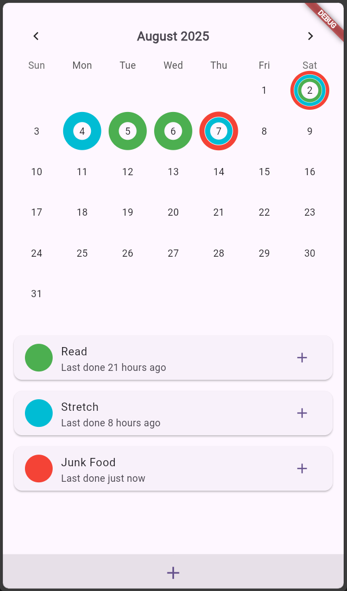
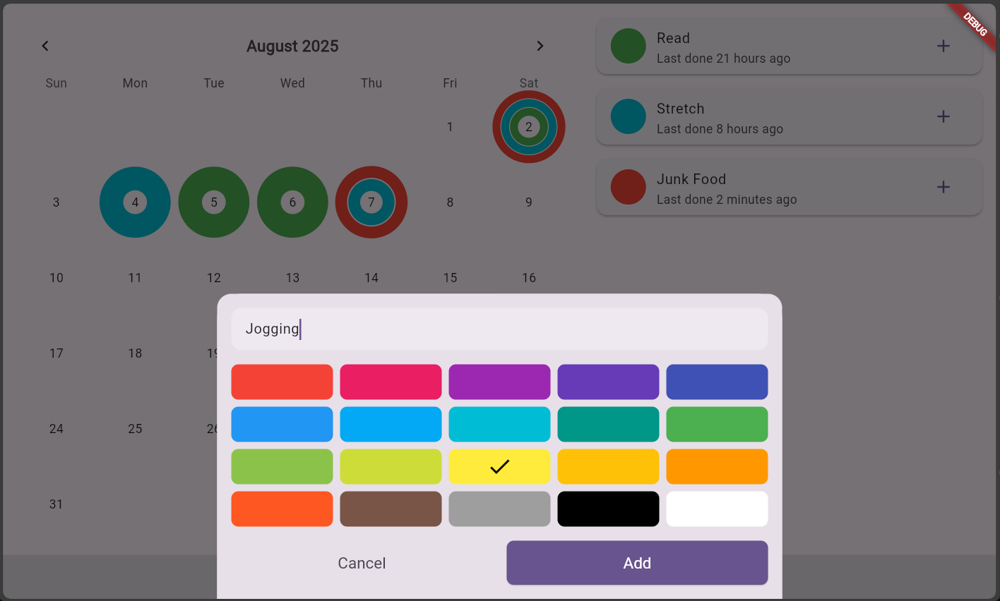
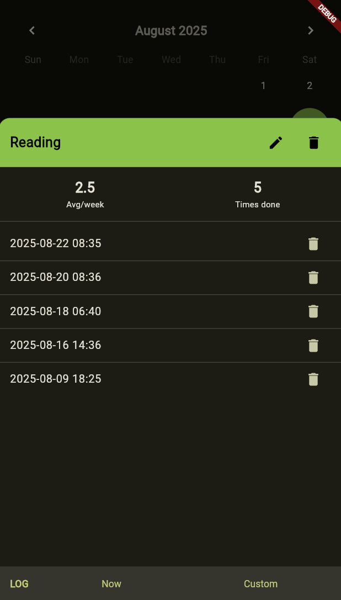

# Habit Tracker

A minimalist habit tracking app built with Flutter.

---

## Features

- **Add & log habits** with a name and color
- **Calendar view** showing completed days with colored rings
- **Per-habit history**: timestamped log entries
- **Responsive layout**: app adapts to tablet landscape devices
- **Clean material design**

---

## Screenshots

| Home Screen                          | Landscape New Habit                    | Habit Details                             |
|--------------------------------------|----------------------------------------|-------------------------------------------|
|  |  |  |

---

## Libraries Used

- **[Flutter](https://flutter.dev/)** - UI toolkit
- **[provider](https://pub.dev/packages/provider)** - State management
- **[hive](https://pub.dev/packages/hive)** - Persistence
- **[table_calendar](https://pub.dev/packages/table_calendar)** - Calendar widget
- **[intl](https://pub.dev/packages/intl)** - Date/time formatting
---
